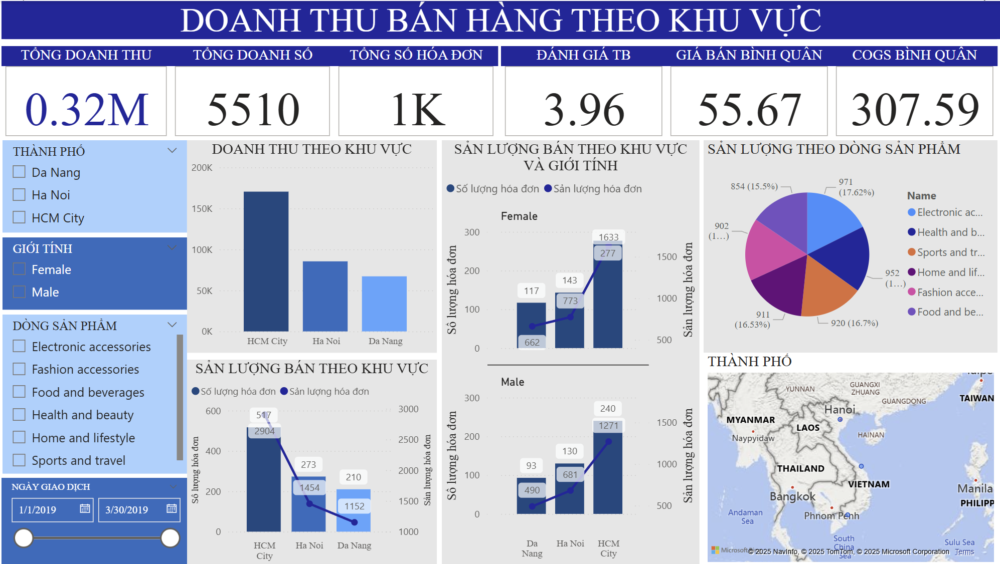

# Regional Sales Performance Dashboard

## Overview

This project showcases my proficiency in sales data analysis, dashboard creation, and regional performance evaluation using Power BI. The visual report provides insights into sales distribution by city, gender segmentation, and product category performance—skills directly relevant to roles involving sales analytics, business intelligence, and F&B market evaluation.

## Relevant Skills for F&B Product Data Analyst

- **Sales Data Management**: Cleaned and organized transactional data by city, gender, and product line to ensure analytical integrity
- **Interactive Dashboard Design**: Developed a clear and actionable Power BI dashboard to visualize sales trends and consumer patterns
- **Power BI & Excel Expertise**: Utilized DAX and Excel for sales volume analysis, customer segmentation, and profitability metrics
- **Category-Level Insights**: Assessed sales by product category, highlighting performance leaders and underperformers
- **Consumer Behavior Analysis**: Segmented purchasing behavior by gender and geography to inform targeted strategies
- **Data-Driven Recommendations**: Derived actionable insights to guide promotional targeting and inventory planning
- **Effective Data Communication**: Delivered visual narratives that support data-driven decision-making for business teams

## Project Components

### 1. Interactive Power BI Dashboard

The dashboard highlights key metrics and patterns from regional sales data:

- Total Revenue, Invoices, and Sales Volume
- Sales performance by city (HCM City, Ha Noi, Da Nang)
- Gender-based purchasing trends
- Product line sales distribution
- Average selling price, ratings, and COGS per invoice

[Sales Revenues by Regions](https://ueheduvn-my.sharepoint.com/:u:/g/personal/31221025795_ueh_edu_vn/EbeeKYPByW5CkQvt6zgvzUUBVWJdDe3jT0r2fYwbN7tA5Q?e=zdE4jJ)

### 2. Data Preparation & Cleaning Workflow

Focused on ensuring accurate, business-ready data:

- Normalized gender and city fields for consistency
- Mapped product lines to standardized categories
- Created calculated columns for metrics like COGS and average price
- Built time filters for dynamic analysis over Q1 2019 (Jan–Mar)

### 3. Insights & Business Recommendations

Key takeaways from the analysis:

- **HCM City leads** in both revenue and transaction volume, signaling it as a prime focus for promotional investment
- **Female customers** exhibit higher invoice volume and average product interaction—suggesting a gender-tailored campaign could be effective
- **Product Lines**: "Health & Beauty" and "Electronic Accessories" show strongest performance, accounting for over 33% of total volume
- Opportunity to optimize underperforming segments like "Home and Lifestyle" through bundling or cross-category marketing

## Business Impact Analysis

| Business Challenge                          | Data-Driven Solution                                      | Expected Outcome                                        |
| ------------------------------------------- | --------------------------------------------------------- | ------------------------------------------------------- |
| Regional revenue imbalance                  | Reinforce successful strategies in HCM City and replicate in Da Nang | Improved sales performance in lagging regions           |
| Low product movement in certain categories  | Identify and promote trending items within those categories | Higher product turnover and reduced stagnant inventory  |
| Gender-based sales variance                 | Launch segmented campaigns based on consumer behavior      | Increased engagement and conversion rates               |

## Tools & Technologies Used

- **Power BI**: Dashboard creation, interactive filters, and KPIs
- **Microsoft Excel**: Pre-processing, calculations, and data cleaning
- **DAX**: Custom metrics including average price, quantity sold, and regional breakdowns

## How This Project Demonstrates Value for F&B Data Analysis

This dashboard and analysis demonstrate my ability to:

1. Monitor and evaluate sales across multiple variables (location, gender, product)
2. Provide data insights that guide regional and product-level strategies
3. Support cross-functional teams with clean, clear, and visualized data
4. Enhance data quality and interpretability for business operations
5. Derive actionable conclusions that directly inform marketing and product decisions

## Contact Information

* 🌐 [linkedin.com/in/ngọc-châu-ibu](https://linkedin.com/in/ngọc-châu-ibu)
* ✉️ [luungocchauqn@gmail.com](mailto:luungocchauqn@gmail.com)

---

_Note: This project showcases my ability to turn transactional data into impactful insights for F&B and retail businesses—especially useful for roles in data analytics, master data management, and sales optimization._
